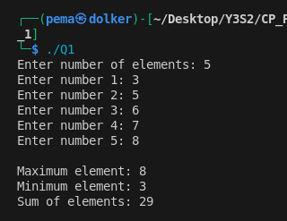
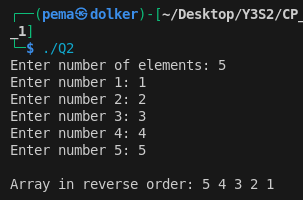
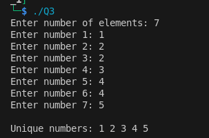
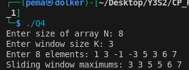
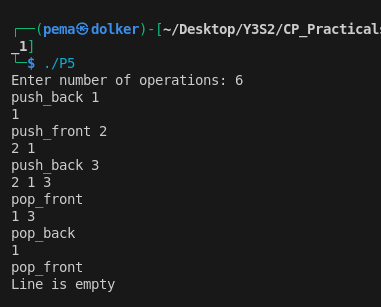
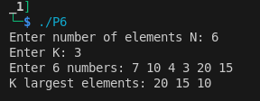
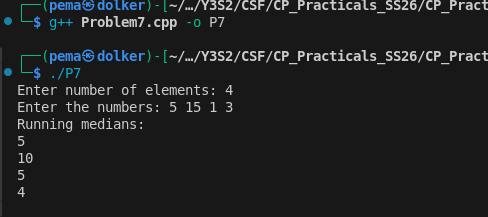
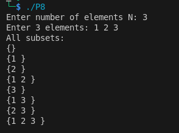
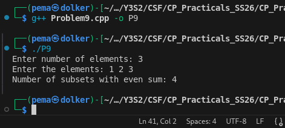
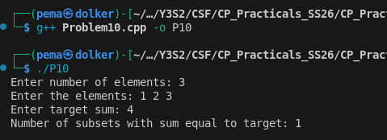

Student: **Pema Dolker**  
Course: CSF     
Semester: SS26

# Practical 1 analysis 

The goal of these exercises in this practical is to practice common data structures and techniques used in problem solving using **C++**.

Each problem contains:
- C++ solution file
- Analysis explaining the approach
- Screenshot of program execution

### List of Problems

1. Dynamic Array Basics (Vector)
2. Reverse the Array
3. Remove Duplicates
4. Sliding Window Maximum (Deque)
5. Balanced Line Problem (Deque)
6. K Largest Elements (Priority Queue)
7. Running Median (Two Heaps)
8. Subset Generation (Bitmasking)
9. Count Subsets with Even Sum
10. Count Subsets with Target Sum

## What I Learned

While solving these problems I practiced several useful data structures and techniques such as:

- Using **vectors as dynamic arrays**
- Working with **deque for double ended operations**
- Using **priority queues (heaps)** for efficient element retrieval
- Understanding **bitmasking for subset generation**
- Improving logical thinking and algorithm design

These exercises helped me understand how different data structures can improve the efficiency of solutions compared to simple brute force approaches.

## Problem 1 — Dynamic Array Basics

### Problem Summary

In this problem we need to read N numbers from the user and store them in a dynamic container. After storing the numbers we find the maximum element, minimum element and also the sum of all elements.

### Algorithm Explanation

First the program asks the user to enter the value of N. Then a vector is used to store the numbers dynamically. A loop is used to take N inputs and push them into the vector.

After storing the numbers, we assume the first element as both the maximum and minimum. Then we traverse the vector using a loop. During the traversal we compare each element with the current max and min values and update them if needed. At the same time we keep adding the values to calculate the sum.

Finally the program prints the maximum value, minimum value and the sum.

### Time Complexity

The program loops through the elements once to compute the values.

Time Complexity: **O(N)**

### Space Complexity

The vector stores all N elements.

Space Complexity: **O(N)**

### Reflection

This problem helped me understand how vectors work as dynamic arrays in C++. Earlier I only knew about normal arrays which need fixed size. Using vector and push_back made it easier to store elements without worrying about the size.

---

## Problem 2 — Reverse the Array

### Problem Summary

This problem asks us to read N integers and print them in reverse order. Instead of changing the array itself, we only need to print the elements starting from the last index.

### Algorithm Explanation

First we read the value of N and store the elements in a vector. A loop is used to take the inputs.

After that we use another loop which starts from index `N-1` and goes backwards until index `0`. Each element is printed during the traversal. Since the traversal goes from the end to the beginning, the output appears in reverse order.

### Time Complexity

We traverse the vector once.

Time Complexity: **O(N)**

### Space Complexity

The vector stores N elements.

Space Complexity: **O(N)**

### Reflection

This problem helped me practice reverse traversal in arrays and vectors. Initially I thought we had to create another array, but then I realized we can just loop from the last index to the first.

---

## Problem 3 — Remove Duplicates

### Problem Summary

In this problem we are given N integers and we need to remove duplicate values and print only the unique numbers.

### Algorithm Explanation

First the numbers are stored in a vector. Then we sort the vector using the sort function. Sorting is important because duplicate values will come next to each other.

After sorting we traverse the vector and print an element only if it is different from the previous element. The first element is always printed. This way duplicate values are skipped.

### Time Complexity

Sorting takes **O(N log N)** and traversal takes **O(N)**.

Overall Time Complexity: **O(N log N)**

### Space Complexity

The vector stores N elements.

Space Complexity: **O(N)**

### Reflection

This problem showed me why sorting can be useful before processing data. By sorting the array first it becomes easy to detect duplicates because they appear next to each other.

---

## Problem 4 — Sliding Window Maximum

### Problem Summary

The problem asks us to find the maximum value for every window of size K in an array. As the window moves one step at a time, we need to print the maximum element inside that window.

### Algorithm Explanation

To solve this efficiently we use a deque. The deque stores indices of elements that could be useful for finding the maximum.

While iterating through the array, we remove indices that are outside the current window. Then we remove elements from the back of the deque if they are smaller than the current element. This ensures that the deque always keeps potential maximum values.

The element at the front of the deque always represents the maximum value for the current window.

### Time Complexity

Each element is inserted and removed from the deque at most once.

Time Complexity: **O(N)**

### Space Complexity

The deque stores at most K indices.

Space Complexity: **O(K)**

### Reflection

This problem helped me understand how a deque can maintain a sliding window maximum efficiently. At first I thought of checking every window separately which would be O(NK), but using a deque reduced the complexity to O(N).

---

## Problem 5 — Balanced Line Problem

### Problem Summary

In this problem we simulate a line where people can enter or leave from both the front and back. After every operation we need to print the current state of the line.

### Algorithm Explanation

A deque is used to represent the line because it allows insertion and deletion from both ends. Depending on the operation, we either push or pop elements from the front or back.

After each operation we traverse the deque and print all the elements to show the current state of the line.

### Time Complexity

Each push or pop operation takes constant time.

Time Complexity: **O(1)** per operation.

### Space Complexity

The deque stores the people currently in the line.

Space Complexity: **O(N)**

### Reflection

This problem helped me understand how deque works in practical situations. It is useful when elements need to be added or removed from both ends, which is something normal queues cannot do easily.

---

## Problem 6 — K Largest Elements

### Problem Summary

The goal of this problem is to find the K largest numbers from a list of N numbers.

### Algorithm Explanation

We use a priority queue which works like a max heap. In a max heap the largest element is always on the top.

First we insert all numbers into the priority queue. Then we remove the top element K times. Each time we remove an element we print it, which gives the K largest numbers in decreasing order.

### Time Complexity

Inserting each element into the heap takes **O(log N)**.

Total Time Complexity: **O(N log N)**

### Space Complexity

The heap stores all N elements.

Space Complexity: **O(N)**

### Reflection

This problem helped me understand how priority queues work. Instead of sorting the entire array, we can use a heap structure to easily get the largest elements.

---

## Problem 7 — Running Median

### Problem Summary

This problem requires us to calculate the median of numbers as they are inserted one by one. After each insertion we need to print the updated median.

### Algorithm Explanation

Two heaps are used in this solution. A max heap stores the smaller half of the numbers while a min heap stores the larger half.

When a new number arrives, it is inserted into one of the heaps depending on its value. Then we balance the heaps so that their sizes differ by at most one. The median is calculated either from the top of the heaps or the average of the two tops.

### Time Complexity

Each insertion into a heap takes **O(log N)**.

Time Complexity: **O(N log N)**

### Space Complexity

Both heaps store all inserted elements.

Space Complexity: **O(N)**

### Reflection

This problem was interesting because it showed how heaps can be used to maintain order while numbers are being inserted continuously. Without heaps we would need to sort the list every time which would be slower.

---

## Problem 8 — Subset Generation

### Problem Summary

The problem asks us to generate all possible subsets of a given set of numbers.

### Algorithm Explanation

We use the bitmask technique to generate subsets. If there are N elements, then there are `2^N` possible subsets.

Each subset can be represented using a binary number. For every bitmask from `0` to `2^N - 1`, we check which bits are set. If the j-th bit is set, we include the j-th element in the subset.

### Time Complexity

We generate `2^N` subsets and check N elements for each.

Time Complexity: **O(N × 2^N)**

### Space Complexity

The vector stores N elements.

Space Complexity: **O(N)**

### Reflection

This problem helped me understand how binary numbers can represent subsets. Using bitmasking made it easier to generate all possible combinations.

---

## Problem 9 — Count Subsets with Even Sum

### Problem Summary

This problem asks us to count how many subsets of a given set have an even sum.

### Algorithm Explanation

We generate all subsets using the bitmask method. For each subset we calculate the sum of the elements included in that subset.

If the sum is divisible by 2, we increase the counter. After checking all subsets, we print the total count.

### Time Complexity

All subsets are generated.

Time Complexity: **O(N × 2^N)**

### Space Complexity

Only the input array is stored.

Space Complexity: **O(N)**

### Reflection

This problem made me practice the subset generation technique again. It showed how the same bitmask idea can be used to solve different types of problems.

---

## Problem 10 — Count Subsets with Target Sum

### Problem Summary

In this problem we count the number of subsets whose sum is equal to a given target value.

### Algorithm Explanation

First we store the numbers in a vector. Then we generate all subsets using bitmasking. For every subset we calculate the sum of included elements.

If the calculated sum matches the target value, we increase the count. At the end we print the total number of subsets that match the target.

### Time Complexity

All subsets are checked.

Time Complexity: **O(N × 2^N)**

### Space Complexity

The vector stores the input elements.

Space Complexity: **O(N)**

### Reflection

This problem helped me understand how subset generation can be used for solving sum based problems. Even though the approach is brute force, it works well for small input sizes.

---
