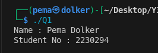
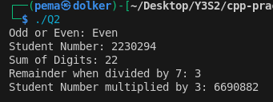
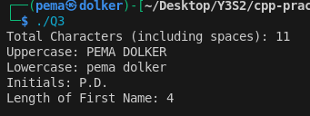
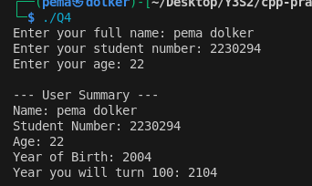
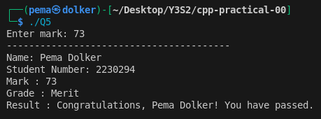
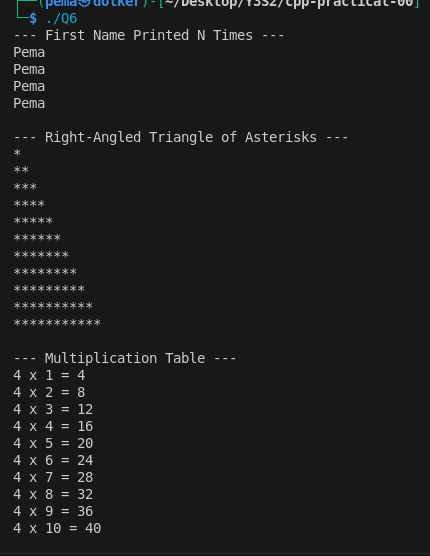
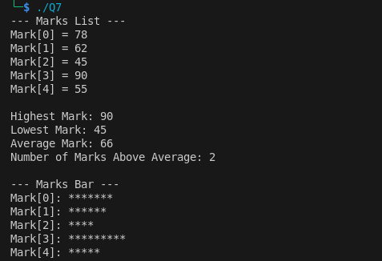
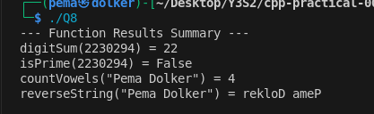
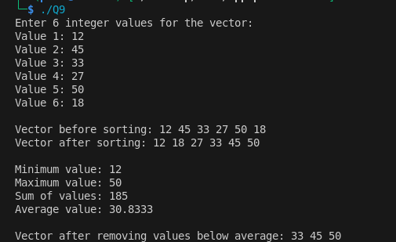
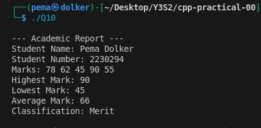

## C++ Practical Report

**Summary of Tasks and Learning Points:**

1. **Personal Introduction & Arithmetic (Q1–Q2):**

   * Learned to declare variables for name and student number.
   * Practiced formatted output with `cout`.
   * Performed arithmetic on student number: sum of digits, odd/even check, remainder, multiplication.
   * Explored string operations: character count, uppercase/lowercase conversion, initials extraction, and first name length.
   
   

   

2. **User Input & Type Conversion (Q3–Q4):**

   * Collected user input for name, student number, age, and marks.
   * Calculated year of birth and year when the user turns 100.
   * Implemented conditional statements to classify marks (Distinction, Merit, Pass, Fail) with input validation.'

    

    

3. **Loops & Patterns (Q5–Q6):**

   * Used loops to repeat names, create a triangle pattern of asterisks, and print multiplication tables.
   * Reinforced understanding of loops and nested loops for structured output.

   

    

4. **Arrays & Statistics (Q7):**

   * Declared and initialized arrays to store marks.
   * Computed highest, lowest, average marks, and counts above average.
   * Displayed data visually with simple bar charts.

     

5. **Functions & Modular Programming (Q8):**

   * Created reusable functions for digit sum, prime check, vowel count, and string reversal.
   * Practiced modular programming and clear result presentation.

   

6. **Vectors & Dynamic Collections (Q9):**

   * Used STL vectors for dynamic data storage.
   * Performed sorting, min/max/sum calculations, and filtered values below average.

    

7. **Classes & Object-Oriented Design (Q10):**

   * Designed a `Student` class with private attributes and methods.
   * Learned encapsulation by accessing data only via methods.
   * Generated a formatted academic report with student information and marks.

    

**Conclusion:**
This practical reinforced the basics of C++ programming, from simple I/O to object-oriented design. Key takeaways include proper variable handling, string manipulation, loops, arrays, functions, vectors, and encapsulation using classes. Overall, it helped consolidate core programming skills in a structured, hands-on way.
